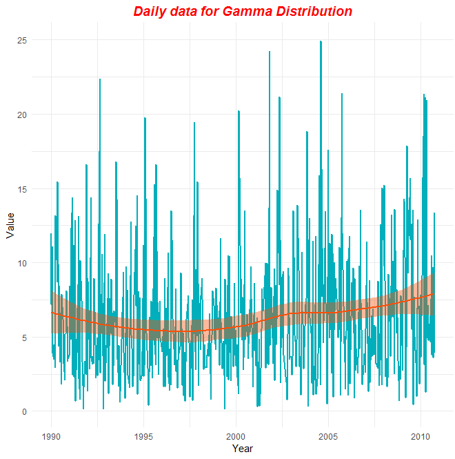
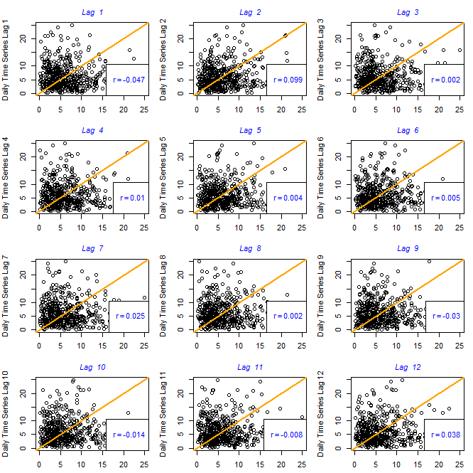

## 1) Simulation of a Time Series with Gamma Distribution and Graphical Representation

1) In the time series, 500 values were simulated using Gamma Distribution.
2) As can be seen from the graphical representation the series doesn't have a trend and no seasonalities are observed. By smoothing the time series with method "loess" shows that there is no trend in this case.
3) White Noises are identifiable.
4) The time series is stationary.


```R
library(ggplot2)
library(zoo)

data=rgamma ( n =500 ,shape =2 , scale =3)

ts_data=ts(data,frequency=24,start=c(1990,1)

df=data.frame(Value=as.matrix(ts_data), Year=as.Date(as.yearmon(time(ts_data))))
head(df)

p=ggplot(data = df, aes(x =Year, y = Value))
+ geom_line(color = "#00AFBB", size = 1) 
+ ggtitle("Daily data for Gamma Distribution")
+ theme(plot.title = element_text(hjust = 0.5, color="red", size=14, face="bold.italic"))

p + stat_smooth(color = "#FC4E07", fill = "#FC4E07",method = "loess")
```

Graphic results




## Retë për N[1], N[2], N[3], ..., N[12] për serinë e parë 
1)	Për të kuptuar më mirë retë e pikave ndërtoj një funksion, i cili do të vizatoj për lage të ndryshme edhe një drejtëz lineare. Paraqes edhe koeficientin e autokorrelacionit poshtë boshteve të x-it
2)  Reja e pikave është e rrumbullakosur afër zeros dhe koeficientët e autokorrelacionit janë më afër zeros sesa 1
3)	Duke qenë se seria është stacionare vihet re që nuk kemi trend stokatik

```R
l <- length(ts_data)
r <-c()
par(mfrow=c(4,3))
for (i in 1:12)
{
  lagged<- ts_data[(1+i): l]
  laggedToo = ts_data[1:(l-i)]
  r[i] <- round(cor(lagged, laggedToo),3)
  
  plot(lagged, laggedToo,col="black", xlab ="", ylab=paste("Daily Time Series Lag",i))
  title(main = paste("Lag ",i), sub = paste("", r[i]),
  cex.main = 1,   font.main= 3, col.main= "blue",
  cex.sub = 0.55, font.sub = 2, col.sub = "blue")
  
  leg <- (as.expression(substitute(atop(r == cor), list(cor=round(r[i],3)))))
  leg1 <- sapply(leg, as.expression)
  legend("bottomright", legend=leg1, text.col ="blue", bg="white", x.intersp=0)
  abline(a=0, b=1, col="orange",lwd=2)    
}
```

Graphic results



