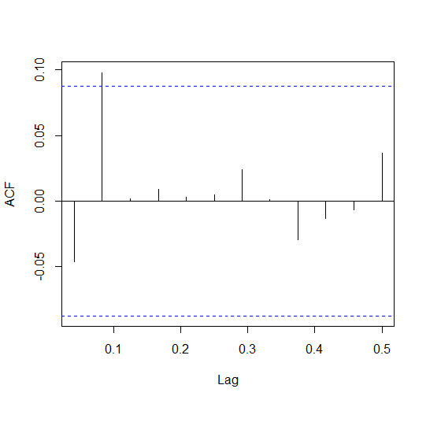
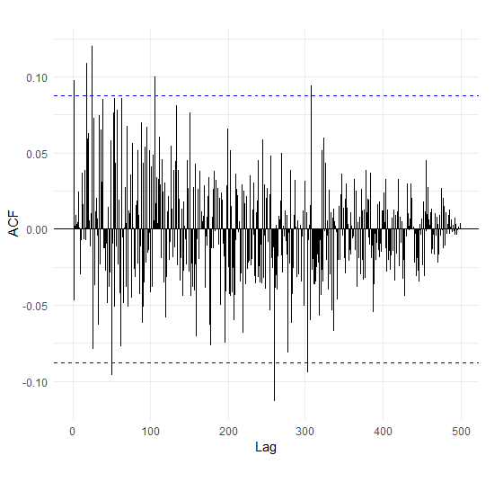
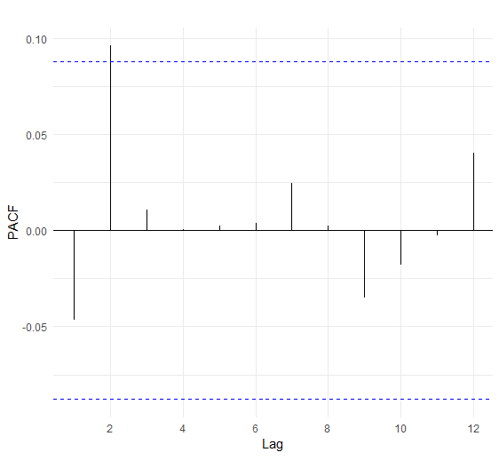
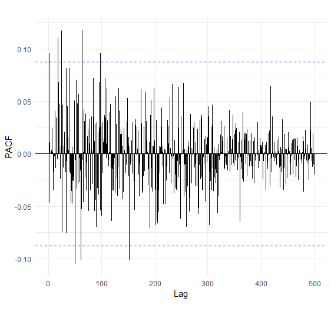
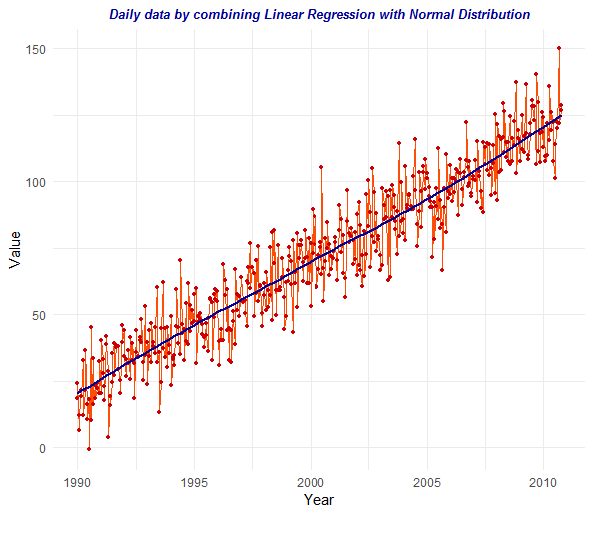
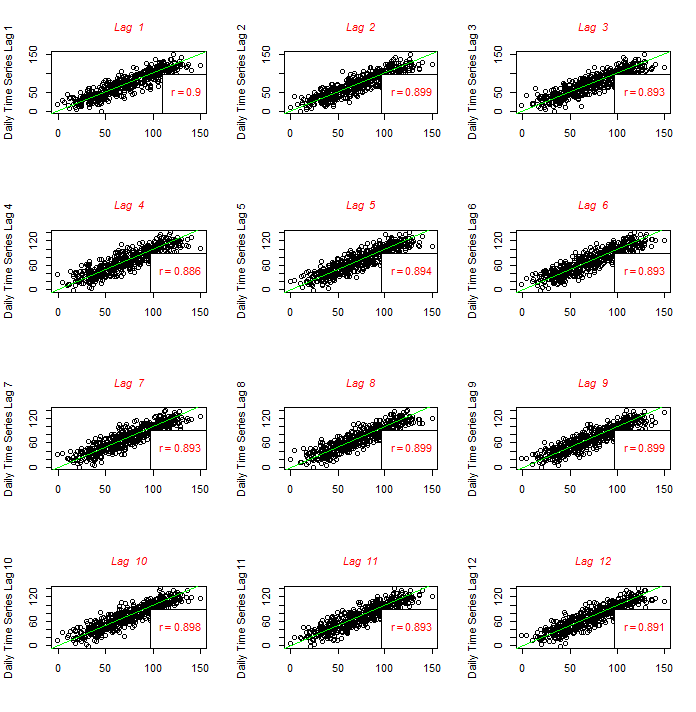
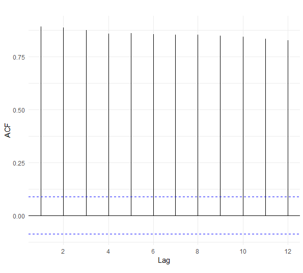
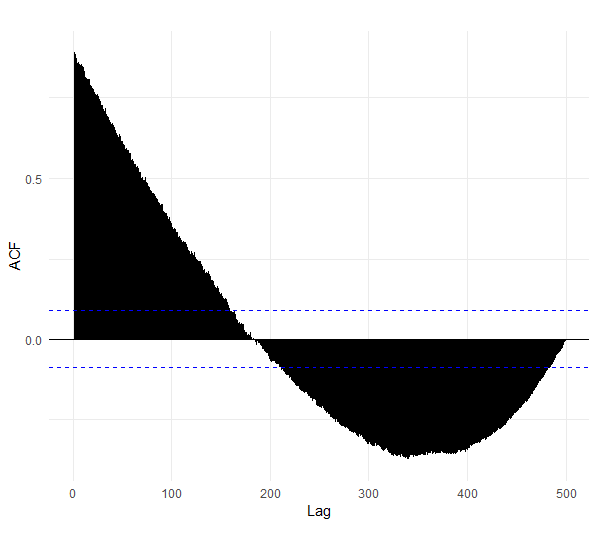

### 1) Simulation of a Time Series with Gamma Distribution and Graphical Representation

1) In the time series, 500 values were simulated using Gamma Distribution.
2) As can be seen from the graphical representation the series doesn't have a trend and no seasonalities are observed. By smoothing the time series with method "loess" shows that there is no trend in this case.
3) White Noises are identifiable.
4) The time series is stationary.


```R
library(ggplot2)
library(zoo)

data=rgamma ( n =500 ,shape =2 , scale =3)

ts_data=ts(data,frequency=24,start=c(1990,1)

df=data.frame(Value=as.matrix(ts_data), Year=as.Date(as.yearmon(time(ts_data))))
head(df)

p=ggplot(data = df, aes(x =Year, y = Value))
geom_line(color = "#00AFBB", size = 1) 
ggtitle("Daily data by Gamma Distribution")
theme(plot.title = element_text(hjust = 0.5, color="red", size=14, face="bold.italic"))

p + stat_smooth(color = "#FC4E07", fill = "#FC4E07",method = "loess")
```

Graphic results

 


### Scatter plots for *N*<sub>1</sub> , *N*<sub>2</sub> , *N*<sub>3</sub> , ..., *N*<sub>12</sub>   
1)	Scatter plots help us to understand better the nature of time series. The following function draws a straight line for every lag.       Autocorrelation coefficient are shown bottomright on the graph.
2) As can be seen from the graphical representation almost all the points are near zero and the autocorrelation coefficient is also near zero.

```R
l <- length(ts_data)
r <-c()
par(mfrow=c(4,3))
for (i in 1:12)
{
  lagged<- ts_data[(1+i): l]
  laggedToo = ts_data[1:(l-i)]
  r[i] <- round(cor(lagged, laggedToo),3)
  
  plot(lagged, laggedToo,col="black", xlab ="", ylab=paste("Daily Time Series Lag",i))
  title(main = paste("Lag ",i), sub = paste(""),
  cex.main = 1,   font.main= 3, col.main= "blue",
  cex.sub = 0.55, font.sub = 2, col.sub = "blue")
  
  leg <- (as.expression(substitute(atop(r == cor), list(cor=round(r[i],3)))))
  leg1 <- sapply(leg, as.expression)
  legend("bottomright", legend=leg1, text.col ="blue", bg="white", x.intersp=0)
  abline(a=0, b=1, col="orange",lwd=2)    
}
```

Graphic results

 

### Autocorrelation coefficient and correlogram graph

Autocorrelation coefficients for lag=1:12         
    *r<sub>1</sub>=-0.047;* *r<sub>2</sub>=0.099;* *r<sub>3</sub>=0.002;* *r<sub>4</sub>=0.01;* *r<sub>5</sub>=0.004;*         *r<sub>6</sub>=0.005;* *r<sub>7</sub>=0.025;* *r<sub>8</sub>=0.002;* *r<sub>9</sub>=-0.03;* *r<sub>10</sub>=-0.014;*     *r<sub>11</sub>=-0.008;* *r<sub>12</sub>=0.038.*
     
95% confidence interval is <b>]-0.08765386;0.08765386[</b>
    
Based on the correlogram for 12 lag's, only one of the autocorrelations is outside dhe cofidence interval which approves the hypothesis that autocorrelation values are near zero. 
 

```R  
     ggAcf(ts_data, lag.max = 12, type = "correlation", plot = TRUE, na.action = na.contiguous, demean = TRUE,main="")
     ggAcf(ts_data, lag.max = length(ts_data), type = "correlation", plot = TRUE, na.action = na.contiguous, demean = TRUE,main="")
     
     L=length(ts_data)
     1.96/sqrt(L) 
     [1] 0.08765386
     (-1)*1.96/sqrt(L) 
     [1] -0.08765386
```

Graphical results for 12 lag's 

   

Graphical results for all the data

    
 
PACF Autocorrelation 

```R
ggPacf(ts_data,lag.max = 12, plot = TRUE, na.action =na.contiguous, demean = TRUE, main="")  
ggPacf(ts_data,lag.max = length(ts_data), plot = TRUE, na.action =na.contiguous, demean = TRUE, main="")  
```
Graphical results

  
   
 
### 2) Simulation of a Time Series by Combining Linear Regression with Normal Distribution
 
In this time series are combinated two different simulation, there are simulated 500 values by the linear regression and 500 values by normal distribution with µ=20 and σ^2=10.
As can be seen from the graphical representation the time series presents an increasing trend and the presence of noises is identifiable as a result of normal distribution simulation. 

```R
x=seq(1,100,length.out=500)    
y=1*x+1/2     
z=rnorm(500,20,10)    
w=z+y  

ts_data1=ts(w,frequency=24,start=1990)

df=data.frame(Value=as.matrix(ts_data), Year=as.Date(as.yearmon(time(ts_data))))
head(df)

p=ggplot(data = df, aes(x =Year, y = Value),size=1)
geom_line(color = "#FC4E07", size = 0)
geom_point(size=1, colour="#CC0000")
ggtitle("Daily data by combining Linear Regression with Normal Distribution")
theme(plot.title = element_text(hjust = 0.5, color="#000099", size=10, face="bold.italic"))

p + stat_smooth(color = "#000099", fill = "#000099",method = "loess")
```
Graphical results



### Scatter plots for *N*<sub>1</sub> , *N*<sub>2</sub> , *N*<sub>3</sub> , ..., *N*<sub>12</sub>   
The following function gives scatter plots for 12 lag's and draws a straight line for each one. Autocorrelation coefficient is shown bottomright on the graph. The points are extended during the straight line and the coefficients of autocorrelation are closer to 1 than zero which is related to the nature of the series.

```R
l <- length(ts_data1)
r <-c()
par(mfrow=c(4,3))
for (i in 1:12)
{
  lagged<- ts_data1[(1+i): l]
  laggedToo = ts_data1[1:(l-i)]
  r[i] <- round(cor(lagged, laggedToo),3)
  
  plot(lagged, laggedToo,col="black", xlab ="", ylab=paste("Daily Time Series Lag",i))
  title(main = paste("Lag ",i), sub = paste(""),
  cex.main = 1,   font.main= 3, col.main= "red",
  cex.sub = 0.55, font.sub = 2, col.sub = "red")
  
  leg <- (as.expression(substitute(atop(r == cor), list(cor=round(r[i],3)))))
  leg1 <- sapply(leg, as.expression)
  legend("bottomright", legend=leg1, text.col ="red", bg="white", x.intersp=0)
  abline(a=0, b=1, col="green",lwd=1)    
}
```
Graphical results




### Autocorrelation coefficient and correlogram graph

Autocorrelation coefficients for lag=1:12         
*r<sub>1</sub>=0.9;* *r<sub>2</sub>=0.899;* *r<sub>3</sub>=0.893;* *r<sub>4</sub>=0.886;* *r<sub>5</sub>=0.894;*         *r<sub>6</sub>=0.893;* *r<sub>7</sub>=0.893;* *r<sub>8</sub>=0.899;* *r<sub>9</sub>=0.899;* *r<sub>10</sub>=0.898;*     *r<sub>11</sub>=0.893;* *r<sub>12</sub>=0.891.*
     
95% confidence interval is <b>]-0.08765386;0.08765386[</b>

As the series has an increasing trend it is noticed that autocorrelations go slower toward zero than in the first series simulated by Gamma Distribution.
In the following correlogram graph are taken 12 first lag's to see how autocorrelations go straight to zero and in the second correlogram graph is taken all the data length.
Partial Autocorrelation function is also given.

```R  
     ggAcf(ts_data1, lag.max = 12, type = "correlation", plot = TRUE, na.action = na.contiguous, demean = TRUE,main="")
     ggAcf(ts_data1, lag.max = length(ts_data), type = "correlation", plot = TRUE, na.action = na.contiguous, demean = TRUE,main="")
     
     L=length(ts_data1)
     1.96/sqrt(L) 
     [1] 0.08765386
     (-1)*1.96/sqrt(L) 
     [1] -0.08765386
```

Graphical results for 12 lag's 

   

Graphical results for all the data

    
 
PACF Autocorrelation 

```R
ggPacf(ts_data1,lag.max = 12, plot = TRUE, na.action =na.contiguous, demean = TRUE, main="")  
ggPacf(ts_data1,lag.max = length(ts_data), plot = TRUE, na.action =na.contiguous, demean = TRUE, main="")  
```
Graphical results

  
   
  
  
:octocat: 
