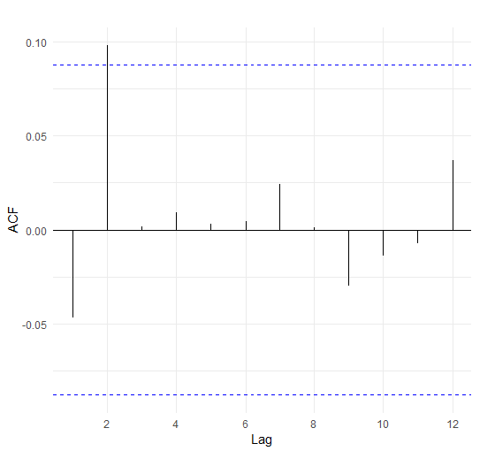

## 1) Simulation of a Time Series with Gamma Distribution and Graphical Representation

1) In the time series, 500 values were simulated using Gamma Distribution.
2) As can be seen from the graphical representation the series doesn't have a trend and no seasonalities are observed. By smoothing the time series with method "loess" shows that there is no trend in this case.
3) White Noises are identifiable.
4) The time series is stationary.


```R
library(ggplot2)
library(zoo)

data=rgamma ( n =500 ,shape =2 , scale =3)

ts_data=ts(data,frequency=24,start=c(1990,1)

df=data.frame(Value=as.matrix(ts_data), Year=as.Date(as.yearmon(time(ts_data))))
head(df)

p=ggplot(data = df, aes(x =Year, y = Value))
+ geom_line(color = "#00AFBB", size = 1) 
+ ggtitle("Daily data for Gamma Distribution")
+ theme(plot.title = element_text(hjust = 0.5, color="red", size=14, face="bold.italic"))

p + stat_smooth(color = "#FC4E07", fill = "#FC4E07",method = "loess")
```

Graphic results


## Scatter plots for *N*<sub>1</sub> , *N*<sub>2</sub> , *N*<sub>3</sub> , ..., *N*<sub>12</sub>   
1)	Scatter plots help us to understand better the nature of time series. The following function draws a straight line for every lag.       Correlation coefficient are shown bottomright on the graph.
2)  As can be seen from the graphical representation almost all the points are near zero and the correlation coefficient is also near zero.

```R
l <- length(ts_data)
r <-c()
par(mfrow=c(4,3))
for (i in 1:12)
{
  lagged<- ts_data[(1+i): l]
  laggedToo = ts_data[1:(l-i)]
  r[i] <- round(cor(lagged, laggedToo),3)
  
  plot(lagged, laggedToo,col="black", xlab ="", ylab=paste("Daily Time Series Lag",i))
  title(main = paste("Lag ",i), sub = paste("", r[i]),
  cex.main = 1,   font.main= 3, col.main= "blue",
  cex.sub = 0.55, font.sub = 2, col.sub = "blue")
  
  leg <- (as.expression(substitute(atop(r == cor), list(cor=round(r[i],3)))))
  leg1 <- sapply(leg, as.expression)
  legend("bottomright", legend=leg1, text.col ="blue", bg="white", x.intersp=0)
  abline(a=0, b=1, col="orange",lwd=2)    
}
```

Graphic results


3)	Autocorrelation coefficient and correlogram graph

    Autocorrelation coefficients for lag=1:12         
    *r<sub>1</sub>=-0.047;* *r<sub>2</sub>=0.099;* *r<sub>3</sub>=0.002;* *r<sub>4</sub>=0.01;* *r<sub>5</sub>=0.004;*         *r<sub>6</sub>=0.005;* *r<sub>7</sub>=0.025;* *r<sub>8</sub>=0.002;* *r<sub>9</sub>=-0.03;* *r<sub>10</sub>=-0.014;*     *r<sub>11</sub>=-0.008;* *r<sub>12</sub>=0.038.*
     
    Confidence interval is _]-0.08765386;0.08765386[_
    
    •	Vihet re se pjesa më e madhe e autokorrelacioneve është brenda intervalit të besimit dhe vetëm një autokorrelacion ndodhet jashtë këtij intervali ai në lagun 12, pra themi se hipoteza që vlera e autokorrelacionit është zero pranohet për më tepër shohim edhe korrelogramën më poshtë
    •	Vihet re se me rritjen e lagut autokorrelacionet bëhen zero, pra seria është stacionare

     ```R
     library(FinTS)
     
     Acf(ts_data, lag.max = 12, type = "correlation", plot = TRUE, na.action = na.contiguous, demean = TRUE,main="")
     Acf(ts_data, lag.max = length(ts_data), type = "correlation", plot = TRUE, na.action = na.contiguous, demean = TRUE,main="")
     
     L=length(ts_data)
     1.96/sqrt(L) 
     [1] 0.08765386
     (-1)*1.96/sqrt(L) 
     [1] -0.08765386
     ```

  
 
   
 
 
 
 
 :octocat: 
