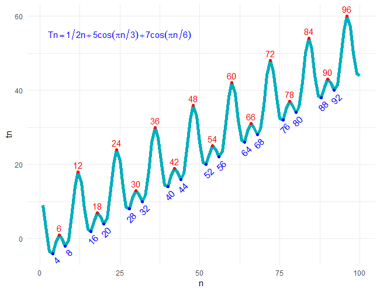
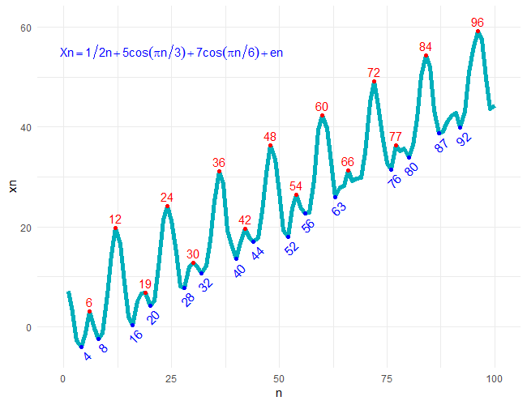
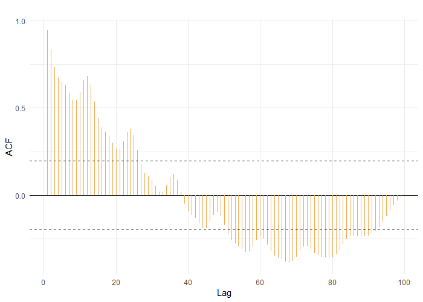
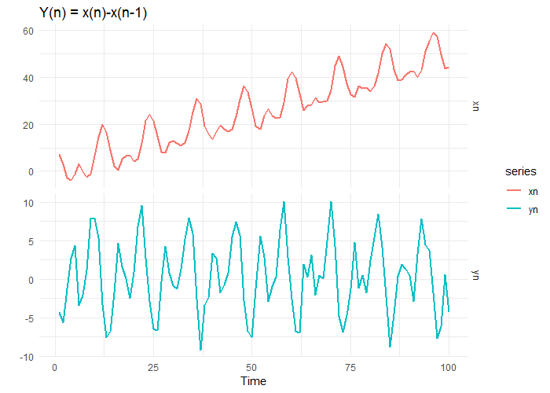
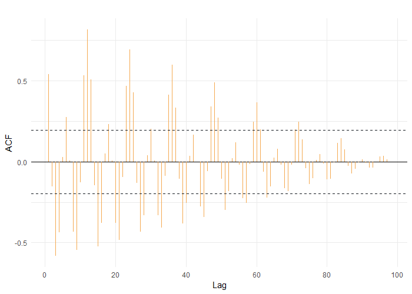
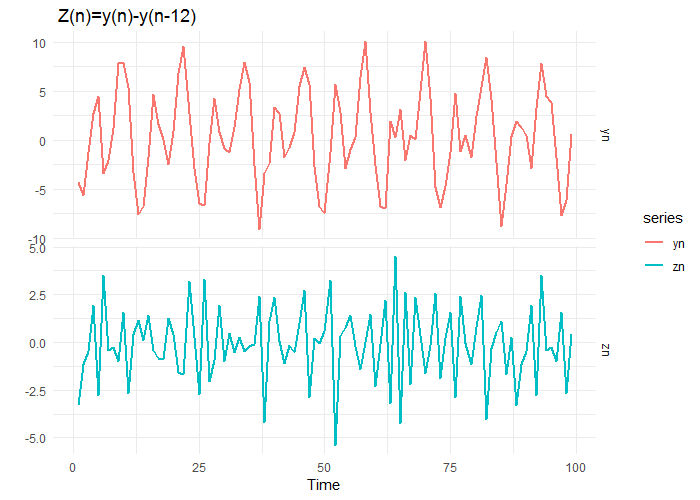
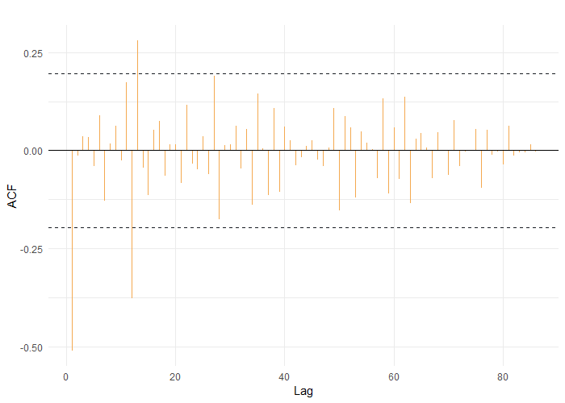

### 1) Simulation of Time Series with Trend and Seasonality, *T*<sub>n</sub>=an+bcos(πn/3)+ccos(πn/6), n=1, ..., 100

As it can be seen from the graphical results the time series is a superposition of a growing trend and two seasonality (periods 6 and 12). 

```R

library (ggplot2)
library(ggpmisc)

n=seq(1,100)
a=1/2
b=5
c=7
tn=a*n+b*cos(pi*n/3)+c*cos(pi*n/6)
ts_data1=ts(tn)

ggplot(data = ts_data1, aes(x = n, y = tn), as.numeric = TRUE) +
geom_line(color = "#00AFBB", size = 2)+ 
stat_peaks(colour = "red") +
stat_peaks(geom = "text", colour = "red", vjust = -0.5 ) +
stat_valleys(colour = "blue") +
stat_valleys(geom = "text", colour = "blue", angle = 45,vjust = 1.5, hjust = 1)+
annotate("text", x=25, y=55, label = "Tn == 1/2*n+5*cos(pi*n/3)+7*cos(pi*n/6)", parse=T, colour="blue", size=4)+
ylim(-5, 61)+
xlim(-1,101)

```

Graphic results

 
 
### 2) Simulation of noises in time series *x*<sub>n</sub>=*t*<sub>n</sub>+*e*<sub>n</sub>, where *e*<sub>n</sub> are independent case variables N (0,1)

After the simulation of noises the time series appears differently. The growth trend is still observed, but seasonalities become less visible.

```R

en=rnorm(100)
xn=tn+en
ts_data=ts(xn)

ggplot(data = ts_data, aes(x = n, y = xn), as.numeric = TRUE) +
geom_line(color = "#00AFBB", size = 2)+ 
stat_peaks(colour = "red") +
stat_peaks(geom = "text", colour = "red", vjust = -0.5 ) +
stat_valleys(colour = "blue") +
stat_valleys(geom = "text", colour = "blue", angle = 45,vjust = 1.5, hjust = 1)+
annotate("text", x=25, y=55, label = "Xn == 1/2*n+5*cos(pi*n/3)+7*cos(pi*n/6)+en", parse=T, colour="blue", size=4)+
ylim(-5, 61)+
xlim(-1,101)

```

Graphic results

 
 
### 3) Auto-Correlations function for *X*<sub>n</sub>=*t*<sub>n</sub>+*e*<sub>n</sub>

The autocorrelation function shows that *r*<sub>1</sub> is closer to 1 than zero because the series has a trend.

```R

l = length(ts_data)
r = c()
for (i in 1:99){
lagged = ts_data[(1+i): l]
laggedToo = ts_data[1:(l-i)]
r[i] = round(cor(lagged, laggedToo),3)
}

r

 [1]  0.956  0.864  0.783  0.752  0.763  0.771  0.749  0.726  0.751  0.840  0.948  0.996
[13]  0.945  0.830  0.730  0.694  0.709  0.717  0.688  0.657  0.688  0.802  0.937  0.995
[25]  0.931  0.789  0.665  0.617  0.635  0.645  0.607  0.566  0.604  0.748  0.921  0.993
[37]  0.907  0.728  0.570  0.512  0.531  0.540  0.486  0.431  0.482  0.674  0.900  0.992
[49]  0.878  0.645  0.449  0.374  0.385  0.384  0.309  0.243  0.324  0.586  0.871  0.988
[61]  0.843  0.551  0.294  0.185  0.199  0.190  0.090  0.005  0.114  0.461  0.842  0.983
[73]  0.793  0.428  0.112 -0.036 -0.039 -0.055 -0.183 -0.299 -0.140  0.332  0.803  0.971
[85]  0.716  0.244 -0.122 -0.275 -0.289 -0.271 -0.412 -0.549 -0.393  0.200  0.898  0.977
[97]  0.771 -1.000     NA

ci2 = qnorm((1 + .95)/2)/sqrt(length(rnorm(100)))
ggAcf(ts_data, lag.max = length(ts_data), main="") +
    geom_segment(lineend = "butt", color = "#F4A950") +
    geom_hline(yintercept = c(ci2, -ci2), color = "#161B21", linetype = "dashed")
    
```

Graphic results

 
 
### 4) Differentiated Series *Y*<sub>n</sub>=*x*<sub>n</sub>-*x*<sub>n-1</sub>

In the differentiated series we see that trend is removed and the series becomes stationary.

```R

yn=diff(xn,lag=1)
tm=cbind(xn,yn)
head(tm)
tm1=ts(tm)

autoplot(tm1,ylab="",facets = TRUE,main="Y(n) = x(n)-x(n-1)",colour = TRUE,size=1)

```

Graphic results

 
 
### 5) Auto-Correlation function for Differentiated Series

We see that for the Lag=1, *r*<sub>1</sub> is closer to zero because the differentiated series has no trend and it is noticed that autocorrelation coefficients in this case are more within the confidence interval.

```R

l = length(yn)
 r = c()
 for (i in 1:98){
     lagged = yn[(1+i): l]
     laggedToo = yn[1:(l-i)]
     r[i] = round(cor(lagged, laggedToo),3)
 }
 
 r
[1]  0.541 -0.157 -0.606 -0.457  0.030  0.292  0.008 -0.468 -0.599 -0.142  0.596  0.915  0.579 -0.173 -0.627 -0.458
[17]  0.058  0.284  0.007 -0.472 -0.610 -0.122  0.607  0.905  0.566 -0.179 -0.599 -0.463  0.052  0.295  0.008 -0.482
[33] -0.601 -0.134  0.631  0.916  0.531 -0.171 -0.636 -0.430  0.060  0.288 -0.002 -0.493 -0.613 -0.106  0.633  0.927
[49]  0.529 -0.219 -0.631 -0.396  0.049  0.272 -0.044 -0.515 -0.595 -0.038  0.617  0.919  0.522 -0.166 -0.641 -0.446
[65]  0.076  0.252 -0.056 -0.514 -0.586 -0.075  0.705  0.897  0.528 -0.174 -0.605 -0.454  0.041  0.228 -0.065 -0.562
[81] -0.584 -0.037  0.691  0.888  0.531 -0.221 -0.663 -0.426 -0.056  0.178 -0.126 -0.640 -0.954 -0.238  0.669  0.890
[97] -1.000     NA

ci2 = qnorm((1 + .95)/2)/sqrt(length(rnorm(100)))
ggAcf(yn, lag.max = length(yn), main="") +
geom_segment(lineend = "butt", color = "#F4A950") +
geom_hline(yintercept = c(ci2, -ci2), color = "#161B21", linetype = "dashed")
```

Graphic results

 
 
 ### 6)  Deseasonalized Series *Z*<sub>n</sub>=*y*<sub>n</sub>-*y*<sub>n-12</sub> 
 
After the second differentation for Lags=1:12, we can see that the time series becomes even more stationary. There is no trend and seasonalitys in the obtained series. 
 
```R
zn=diff(yn,lag=12)
tm=cbind(yn,zn)
head(tm)
tm2=ts(tm)

autoplot(tm2,ylab="",facets = TRUE,main="Z(n) = y(n)-y(n-12)",colour = TRUE,size=1)

```
Graphic results

 
 
 ### 7)  Auto-Correlation for Deseasonalized Series
 
We argue that ACF represents a strong stationarity of the obtained series, in this case about 95% of the correlation coefficients are within the confidence interval. It is observed that for lag 1, *r*<sub>1</sub> is close to -1 (negative) and the series has no trend.
 
 ```R
 
 l = length(zn)
 r = c()
 for (i in 1:80){
     lagged = zn[(1+i): l]
     laggedToo = zn[1:(l-i)]
     r[i] = round(cor(lagged, laggedToo),3)
 }
 
 r
 [1] -0.519 -0.014  0.036  0.035 -0.042  0.096 -0.142  0.020  0.070 -0.028  0.199 -0.438  0.326 -0.051 -0.134  0.061
[17]  0.089 -0.077  0.019  0.018 -0.103  0.145 -0.046 -0.068  0.051 -0.092  0.288 -0.272  0.021  0.024  0.099 -0.073
[33]  0.085 -0.220  0.231  0.006 -0.206  0.202 -0.202  0.116  0.050 -0.077 -0.034  0.023  0.051 -0.049 -0.087  0.014
[49]  0.237 -0.364  0.222  0.165 -0.335  0.133  0.053  0.009 -0.204  0.380 -0.325  0.175 -0.223  0.463 -0.496  0.120
[65]  0.229  0.041 -0.400  0.273 -0.004 -0.391  0.482 -0.274 -0.020  0.008  0.399 -0.789  0.508 -0.142 -0.046 -0.393

ci2 = qnorm((1 + .95)/2)/sqrt(length(rnorm(100)))
ggAcf(zn, lag.max = length(zn), main="", ci=FALSE) +
geom_segment(lineend = "butt", color = "#F4A950") +
geom_hline(yintercept = c(ci2, -ci2), color = "#161B21", linetype = "dashed")
 
```
Graphic results

 
 
 
 :octocat:
